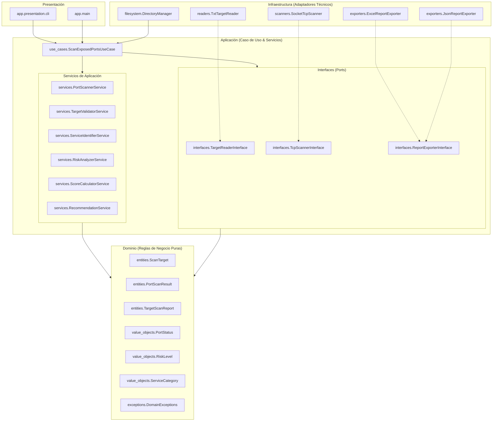
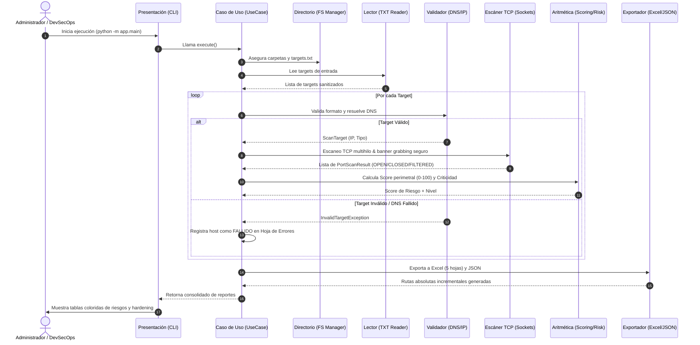

# 🛡️ Exposed Ports Detector (EPD)
### *Plataforma de Auditoría Perimetral Preventiva, Hardening y DevSecOps*

---

[](https://www.python.org/)
[](https://en.wikipedia.org/wiki/Clean_architecture)
[](https://github.com/astral-sh/ruff)
[](https://docs.pytest.org/)
[](https://owasp.org/)

---

## 📋 Descripción del Proyecto

El **Exposed Ports Detector (EPD)** es una solución de auditoría y análisis perimetral de grado corporativo desarrollada en Python 3.11+. Diseñada específicamente bajo las directrices del desarrollo de software seguro y la **Clean Architecture**, la herramienta permite identificar de forma no intrusiva los puertos abiertos, categorizar los servicios expuestos, capturar firmas y banners de protocolos (incluyendo túneles cifrados SSL/TLS seguros) y calcular un índice ponderado de riesgo de seguridad perimetral.

Esta herramienta sirve de apoyo en pipelines de **DevSecOps**, auditorías de infraestructura preventivas, hardening de servidores corporativos y gestión del inventario de activos expuestos a Internet.

---

## ⚖️ Marco Legal, Ético y Uso Permitido

> [!IMPORTANT]
> **AUDITORÍA INTROSPECTIVA Y DEFENSIVA EXCLUSIVA**: Esta utilidad se encuadra estrictamente dentro del marco de la **ciberseguridad defensiva y auditoría interna**. Queda terminantemente prohibido su uso para actividades de reconocimiento hostil, escaneo masivo no autorizado de redes de terceros o cualquier fin malicioso.

### Alineación con Buenas Prácticas de Detección Segura:
* **Conexión TCP Handshake Convencional**: El análisis se ejecuta utilizando llamadas a sockets de tres vías estándar (`socket.create_connection`), dejando registros claros y transparentes (logs) en los balanceadores o cortafuegos perimetrales auditados.
* **Ausencia de Técnicas Stealth u Ofensivas**: No implementa escaneos SYN incompletos, payloads de intrusión, evasión de IDS/IPS ni ataques de fuerza bruta.
* **Banner Grabbing Pasivo de Bajo Nivel**: Se limita a inspeccionar cabeceras iniciales de conexión estándar de texto plano y realizar solicitudes minimalistas conformes a los estándares RFC (como cabeceras `HEAD` en puertos HTTP/HTTPS), garantizando que no se alteren archivos remotos ni se consuma ancho de banda perjudicial.

---

## 🎯 Alineación con Marcos de Seguridad de la Industria

El análisis lógico de riesgos y mitigaciones de EPD se encuentra mapeado directamente con estándares internacionales:
* **CIS Controls v8 (Control 9 - Control de Puertos, Protocolos y Servicios)**: Apoya la mantención y auditoría automatizada de puertos e interfaces de red activas en servidores y nubes híbridas.
* **OWASP Top 10 (A05:2021 - Configuración de Seguridad Incorrecta)**: Identifica de forma proactiva bases de datos expuestas públicamente o puertos de administración administrativa desprotegidos.
* **Directrices NIST SP 800-115 (Technical Guide to Information Security Testing and Assessment)**: Cumple los estándares de recopilación de firmas y análisis perimetral en la fase de descubrimiento técnico pasivo.

---

## 🏗️ Arquitectura de Software (Clean Architecture)

El software sigue una estricta separación de responsabilidades para asegurar independencia total de la lógica de negocio frente a librerías externas o detalles de red.

### Estructura de Capas e Inversión de Dependencias (Mermaid):



---

## 🔄 Pipeline de Ejecución de la Auditoría

El flujo secuencial de tareas se ejecuta de forma estructurada para evitar pérdidas de rendimiento o cuelgues del escaneo:



---

## 📈 Algoritmo de Scoring y Criticidad del Riesgo

EPD evalúa de manera cuantitativa el nivel de exposición de los servidores a través de una fórmula acumulativa basada en las categorías operativas de los puertos detectados en estado `OPEN` (abiertos):

```
Riesgo Total (Target) = ∑ (Peso de Penalización por Puerto Abierto)
```

### Tabla de Pesos y Penalizaciones (`app/config/settings.py`):
| Parámetro | Categoría / Puertos Asociados | Penalización |
| :--- | :--- | :---: |
| **DATABASE** | MySQL (3306), PostgreSQL (5432), MS SQL (1433), MongoDB (27017), Oracle (1521). | **`+30.0`** |
| **ADMIN** | Sockets Docker (2375/2376), SSH (22), RDP (3389), DNS (53). | **`+25.0`** |
| **INSECURE** | FTP (21), Telnet (23) (Transmisión sin cifrado). | **`+25.0`** |
| **CACHE** | Redis (6379), Elasticsearch (9200/9300), Memcached (11211). | **`+25.0`** |
| **WEB_NO_HTTPS**| HTTP convencional (80, 8000, 8080) sin certificado SSL/TLS. | **`+15.0`** |
| **OTHER_OPEN** | Cualquier otro puerto TCP abierto no catalogado. | **`+10.0`** |

### Indexación del Score y Criticidad:
La puntuación acumulada se limita al rango reglamentario **`[0.0, 100.0]`** y se clasifica bajo los siguientes rangos de severidad para priorizar planes de mitigación:

$$\text{Criticidad} = \begin{cases} 
\text{Bajo (LOW)} & \text{si } \text{Score} \in [0.0, 20.0] \\
\text{Medio (MEDIUM)} & \text{si } \text{Score} \in [21.0, 50.0] \\
\text{Alto (HIGH)} & \text{si } \text{Score} \in [51.0, 75.0] \\
\text{Crítico (CRITICAL)} & \text{si } \text{Score} \in [76.0, 100.0] 
\end{cases}$$

---

## 📂 Formato de Reportes Generados (`datos_salida/`)

Al finalizar el análisis de forma exitosa, la plataforma exporta reportes de manera **incremental** (ej: `exposed_ports_report_1.xlsx` si ya existe un reporte previo) para salvaguardar el historial técnico.

### Reporte de Hoja de Cálculo Excel (`.xlsx` - 5 Hojas):
1. **Resumen Ejecutivo**: Consolidado del estado de seguridad por target.
   * *Métricas*: `target`, `ip_resuelta`, `total_puertos_escaneados`, `puertos_abiertos`, `score_riesgo`, `nivel_riesgo`, `estado`, `error`, `fecha_analisis`.
2. **Puertos Abiertos**: Matriz de vectores de ataque perimetrales y debilidades.
   * *Métricas*: `target`, `ip_resuelta`, `puerto`, `servicio`, `categoria`, `banner`, `nivel_riesgo`, `riesgo_detectado`, `recomendacion`.
3. **Detalle Escaneo**: Log de auditoría integral útil para reportes de cumplimiento técnico (ej: ISO 27001 o SOC 2).
   * *Métricas*: `target`, `ip_resuelta`, `puerto`, `estado`, `servicio`, `categoria`, `error`, `fecha_analisis`.
4. **Recomendaciones**: Pautas de acción técnicas directas para administradores de sistemas y redes.
   * *Métricas*: `target`, `puerto`, `servicio`, `prioridad`, `problema`, `recomendacion`.
5. **Errores**: Bitácora de errores DNS o fallos físicos de comunicación, aislando los problemas de conectividad sin interrumpir el flujo.
   * *Métricas*: `target`, `tipo_error`, `mensaje_error`, `fecha_analisis`.

### Reporte JSON Estructurado (`.json`):
Exporta el consolidado completo en formato JSON jerárquico tipado, ideal para ingesta en herramientas SIEM (ej: Splunk, ELK Stack) o tableros de control DevSecOps.

---

## 🛠️ Instalación y Puesta en Marcha

### Requisitos Técnicos:
* Python **3.11** o superior.
* Librerías del sistema para sockets nativos.

### Configuración del Entorno:

1. **Crear el entorno virtual** en el directorio raíz del proyecto:
   ```bash
   python -m venv venv
   ```
2. **Activar el entorno virtual**:
   * **Windows (PowerShell)**:
     ```powershell
     .\venv\Scripts\Activate.ps1
     ```
   * **Linux / macOS**:
     ```bash
     source venv/bin/activate
     ```
3. **Instalar dependencias de producción y testing**:
   ```bash
   pip install -r requirements.txt
   ```

---

## 🚀 Guía de Operación

### 1. Declarar Objetivos de Auditoría
En su primera ejecución, el sistema autogenerará el archivo `datos_entrada/targets.txt`. Puede agregar direcciones IP individuales, rangos o dominios empresariales autorizados:
```txt
# Servidores Corporativos Autorizados
127.0.0.1
localhost
mi-vps-produccion.com
192.168.1.15
```

### 2. Ejecutar Escaneo
Inicie el contenedor de dependencias del aplicativo mediante:
```bash
python -m app.main
```

### 3. Ejecutar Calidad de Código y Pruebas Automatizadas
Para verificar que el linter estricto Ruff y el 100% de los tests unitarios y de integración están en perfecto orden:
```bash
# Formateo automatizado
ruff format .

# Linter estricto
ruff check .

# Ejecución de test suite
pytest
```

---

## 🔮 Roadmap y Escalabilidad del Sistema

Gracias al total desacoplamiento de Clean Architecture, la plataforma está estructurada para incorporar en futuras fases:
- **Adaptador de Red Asíncrono (`asyncio`)**: Escaneos ultra veloces sin bloqueos de hilos de sistema.
- **Notificaciones Webhook (Slack / Microsoft Teams / Email)**: Envío de alertas automatizadas inmediatas ante la detección de puertos críticos expuestos (como bases de datos abiertas).
- **Dashboard Web Interactivo**: Representación analítica mediante Next.js o React para el monitoreo histórico y evolución del Scoring de riesgo de los activos TI.
